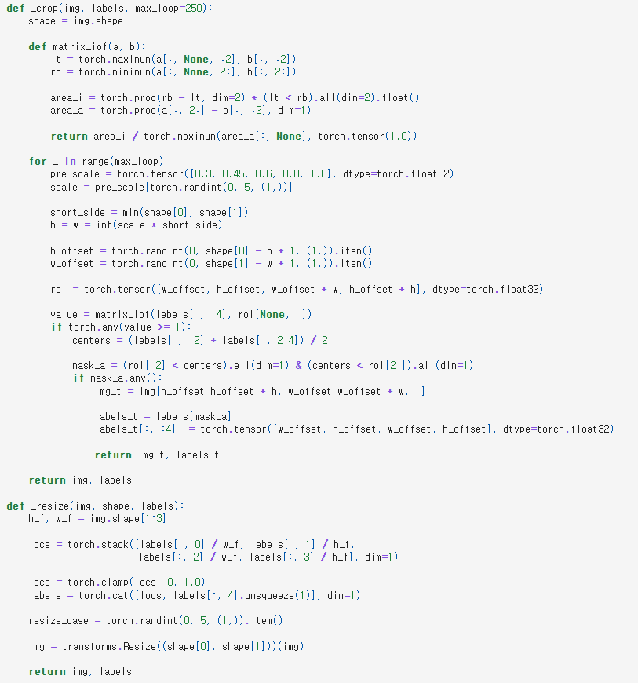
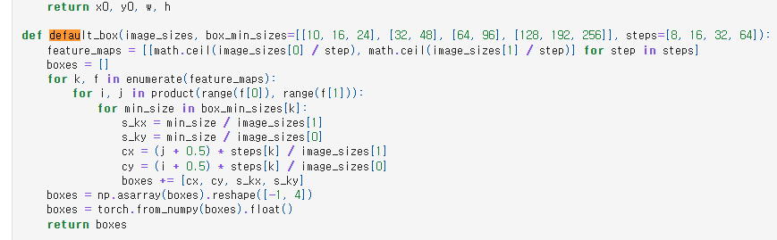
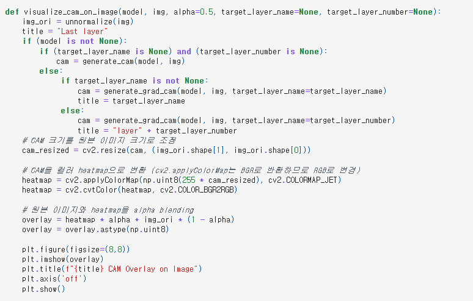
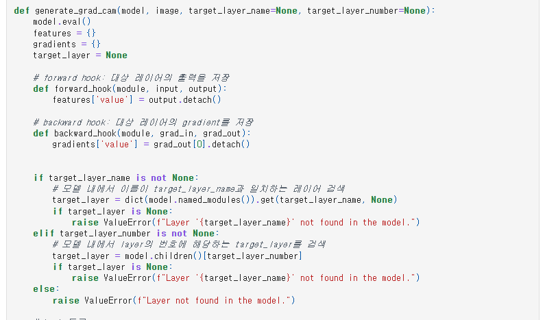
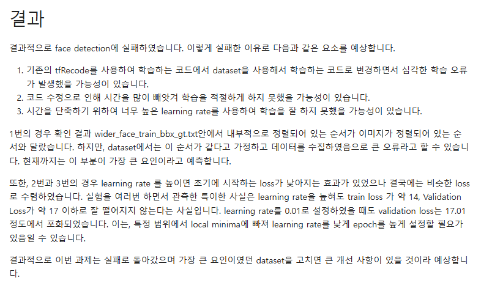

# README

# AIFFEL Campus Online Code Peer Review Templete

- 코더 : 구재현
- 리뷰어 : 임보혁

# PRT(Peer Review Template)

- [ ] **1. 주어진 문제를 해결하는 완성된 코드가 제출되었나요?**
- augmentation, prior box 생성이 되었습니다.
- 이미지는 제출되었으나, 적절한 위치에 바운딩 박스가 있지 않습니다.
- 다만, 왜 실패를 하였는가? 에 대한 예상이 자세하게 정리되어 있습니다.
  
  
  
- [x] **2. 전체 코드에서 가장 핵심적이거나 가장 복잡하고 이해하기 어려운 부분에 작성된
      주석 또는 doc string을 보고 해당 코드가 잘 이해되었나요?**
      

      - 주석이 잘 작성되어있습니다.
- [x] **3. 에러가 난 부분을 디버깅하여 문제를 해결한 기록을 남겼거나
      새로운 시도 또는 추가 실험을 수행해봤나요?**
      

      

      - CAM / Grad-CAM을 시도하였습니다.
- [x] **4. 회고를 잘 작성했나요?**
  
  - 회고가 잘 작성되었습니다.
- [x] **5. 코드가 간결하고 효율적인가요?**
  - 모두 만족하였습니다.

# 회고(참고 링크 및 코드 개선)

```
저도 loss가 13에서 17사이에서 안떨어지고, Nan 값이 나오는 같은 문제가 있었습니다.

SSD가 이상하게 박스를 찍고, 중복 박스 억제가 안 되고, Loc loss가 비정상적으로 천천히 떨어지고, Conf만 떨어지는 상황이 모두 encode_pt()에서의 앵커 좌표 체계 불일치 때문에 생긴 버그
를 해결한 방법입니다.

만약 정상이라면, val_loss 는 일정 epoch가 지난 후, 2~3 사이에 있어야합니다.

1. anchor box 형식 불일치

default_box는 center (cx, cy, w, h) 형식.
GT labels는 corner (xmin, ymin, xmax, ymax) 형식.
IoU 계산에서 둘을 그대로 비교.

2. _encode_bbox 내부는 center 기반 수식
corner → center 변환 필요.

solution.

encoder_pt에

boxes_corner = torch.cat([
    boxes[:, :2] - boxes[:, 2:] / 2,
    boxes[:, :2] + boxes[:, 2:] / 2
], dim=1)

**overlaps = _jaccard(bbox, boxes_corner)

빨간 줄 위에 주황색 3줄 추가.**
```
