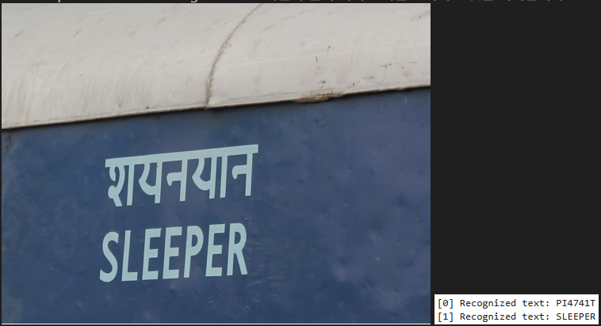
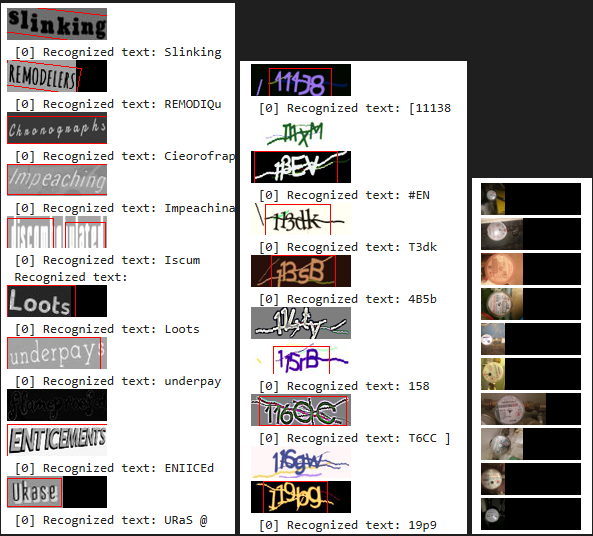
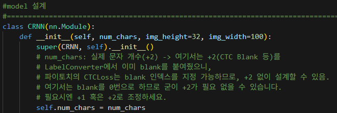
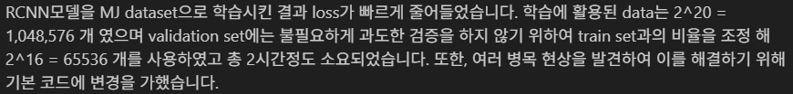
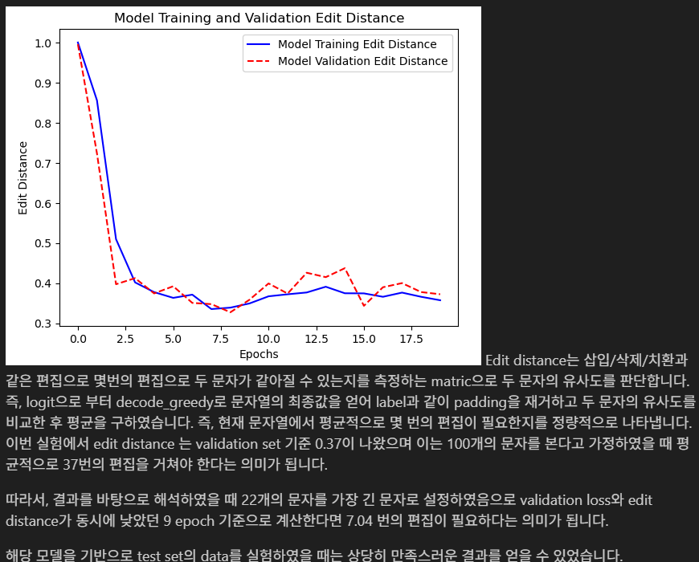
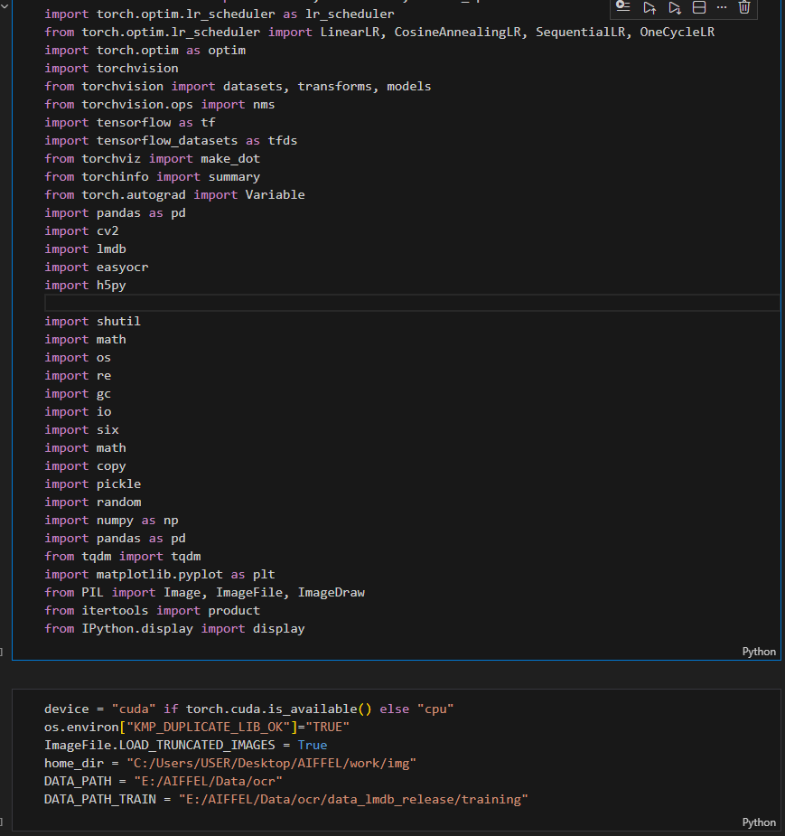

# AIFFEL Campus Online Code Peer Review Templete
- 코더 : 구재현
- 리뷰어 : 이수호


# PRT(Peer Review Template)
- [X]  **1. 주어진 문제를 해결하는 완성된 코드가 제출되었나요?**
    - 문제에서 요구하는 최종 결과물이 첨부되었는지 확인
        - 중요! 해당 조건을 만족하는 부분을 캡쳐해 근거로 첨부  
        
        
    
- [X]  **2. 전체 코드에서 가장 핵심적이거나 가장 복잡하고 이해하기 어려운 부분에 작성된 
주석 또는 doc string을 보고 해당 코드가 잘 이해되었나요?**
    - 해당 코드 블럭을 왜 핵심적이라고 생각하는지 확인
    - 해당 코드 블럭에 doc string/annotation이 달려 있는지 확인
    - 해당 코드의 기능, 존재 이유, 작동 원리 등을 기술했는지 확인
    - 주석을 보고 코드 이해가 잘 되었는지 확인
        - 중요! 잘 작성되었다고 생각되는 부분을 캡쳐해 근거로 첨부  
        
        
- [X]  **3. 에러가 난 부분을 디버깅하여 문제를 해결한 기록을 남겼거나
새로운 시도 또는 추가 실험을 수행해봤나요?**
    - 문제 원인 및 해결 과정을 잘 기록하였는지 확인
    - 프로젝트 평가 기준에 더해 추가적으로 수행한 나만의 시도, 
    실험이 기록되어 있는지 확인
        - 중요! 잘 작성되었다고 생각되는 부분을 캡쳐해 근거로 첨부  
        
        
- [X]  **4. 회고를 잘 작성했나요?**
    - 주어진 문제를 해결하는 완성된 코드 내지 프로젝트 결과물에 대해
    배운점과 아쉬운점, 느낀점 등이 기록되어 있는지 확인
    - 전체 코드 실행 플로우를 그래프로 그려서 이해를 돕고 있는지 확인
        - 중요! 잘 작성되었다고 생각되는 부분을 캡쳐해 근거로 첨부  
        
        
- [X]  **5. 코드가 간결하고 효율적인가요?**
    - 파이썬 스타일 가이드 (PEP8) 를 준수하였는지 확인
    - 코드 중복을 최소화하고 범용적으로 사용할 수 있도록 함수화/모듈화했는지 확인
        - 중요! 잘 작성되었다고 생각되는 부분을 캡쳐해 근거로 첨부  
          
        해당 이미지 외에도 노트북 셀을 model 설계, 시각화 함수, Dataset 설계 등등 핵심 기능을 중심으로 셀을 나누었다.


# 회고(참고 링크 및 코드 개선)
```
노드에서 제공한 코드를 본인의 스타일대로 수정하여 실험을 진행한 게 좋은 것 같다. 직접 코드를 작성하며 코딩 자체에 대한 실력도 늘었을 것 같다. 또한 실험을 진행하면서 필요한 함수를 정의하고, 문제를 발견했을 때 해결하기 위한 인사이트를 도출하는 과정이 깔끔한 것 같다. 코드를 핵심 기능별로 셀을 나누어 작성한 점 또한 좋은 것 같다. 다만 ipynb 파일을 사용하기 때문에 핵심 기능이 나누어지는 섹션마다 markdown 셀을 사용하면 더 깔끔할 것 같다. 
```
